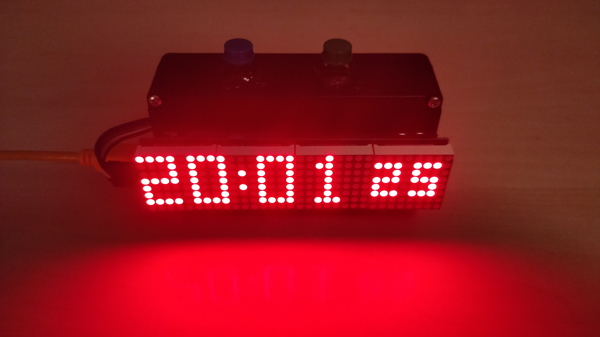
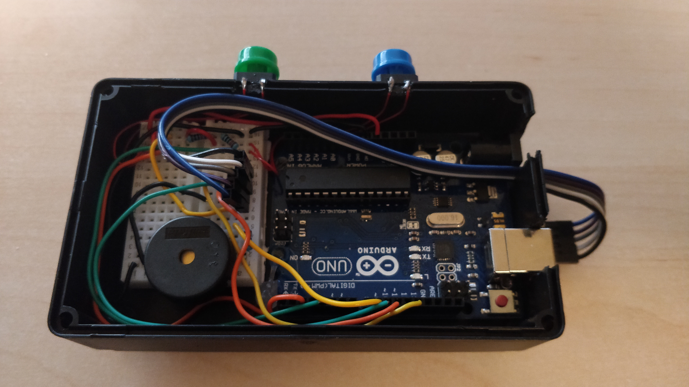

# Arduino-Alarm-Clock
A simple alarm clock made with an arduino

## TODO
- Add intensity change at specific points, like during night it should be on lowest.
- Currently just using a correction value to compensate for the time drag. In the future, RTC should be implemented.
